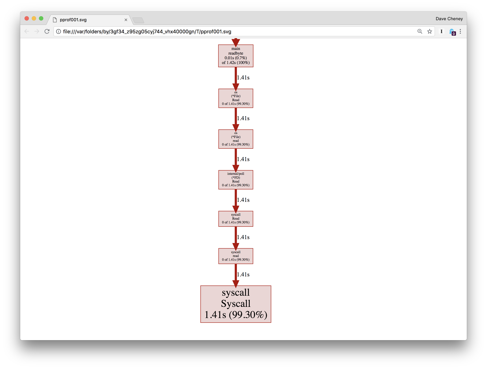

# Performance measurement and profiling

In the prevoius section we looked at benchmarking individual functions which is useful when you know ahead of time where the bottlekneck is. However, often you will find yourself in the position of asking

> Why is this program taking so long to run?

Profiling _whole_ programs which is useful for answering high level questions like. In this section we'll use profiling tools built into Go to investigate the operation of the program from the inside.

## pprof

The first tool we're going to be talking about today is _pprof_. [pprof][1] descends from the [Google Perf Tools][2] suite of tools and has been integrated into the Go runtime since the earliest public releases.

`pprof`  consists of two parts:

- `runtime/pprof` package built into every Go program
- `go`tool`pprof` for investigating profiles.

pprof supports several types of profiling, we'll discuss three of these today: 

- CPU profiling.
- Memory profiling.
- Block (or blocking) profiling.
- Mutex contention profiling.

## CPU profiling

CPU profiling is the most common type of profile, and the most obvious. 

When CPU profiling is enabled the runtime will interrupt itself every 10ms and record the stack trace of the currently running goroutines.

Once the profile is complete we can analyse it to determine the hottest code paths.

The more times a function appears in the profile, the more time that code path is taking as a percentage of the total runtime.

## Memory profiling

Memory profiling records the stack trace when a _heap_ allocation is made.

Stack allocations are assumed to be free and are _not_tracked_ in the memory profile.

Memory profiling, like CPU profiling is sample based, by default memory profiling samples 1 in every 1000 allocations. This rate can be changed.

Because of memory profiling is sample based and because it tracks _allocations_ not _use_, using memory profiling to determine your application's overall memory usage is difficult.

_Personal_Opinion:_ I do not find memory profiling useful for finding memory leaks. There are better ways to determine how much memory your application is using. We will discuss these later in the presentation.

## Block profiling

Block profiling is quite unique. 

A block profile is similar to a CPU profile, but it records the amount of time a goroutine spent waiting for a shared resource.

This can be useful for determining _concurrency_ bottlenecks in your application.

Block profiling can show you when a large number of goroutines _could_ make progress, but were _blocked_. Blocking includes:

- Sending or receiving on a unbuffered channel.
- Sending to a full channel, receiving from an empty one.
- Trying to `Lock` a `sync.Mutex` that is locked by another goroutine.

Block profiling is a very specialised tool, it should not be used until you believe you have eliminated all your CPU and memory usage bottlenecks.

## Mutex profiling

Mutex profiling is simlar to Block profiling, but is focused exclusively on operations that lead to delays caused by mutex contention.

I don't have a lot of experience with this type of profile but I have built an example to demonstrate it. We'll look at that example shortly.

## One profile at at time

Profiling is not free.

Profiling has a moderate, but measurable impact on program performance—especially if you increase the memory profile sample rate.

Most tools will not stop you from enabling multiple profiles at once.

**Do not enable more than one kind of profile at a time.**

If you enable multiple profile's at the same time, they will observe their own interactions and throw off your results.

## Collecting a profile

The Go runtime's profiling interface lives in the `runtime/pprof` package. `runtime/pprof` is a very low level tool, and for historic reasons the interfaces to the different kinds of profile are not uniform. 

As we saw in the previous section, pprof profiling is built into the `testing` package, but sometimes its inconvenient, or difficult, to place the code you want to profile in the context of at `testing.B` benchmark and must use the `runtime/pprof` API directly.

A few years ago I wrote a [small package][0], to make it easier to profile an existing application.

```
import "github.com/pkg/profile"
    
func main() {
	defer profile.Start().Stop()
	...
}
```
We'll use the profile package throughout this section. Later in the day we'll touch on using the `runtime/pprof` interface directly.

### Using pprof

Now that we've talked about what pprof can measure, and how to generate a profile, let's talk about how to use pprof to analyse a profile.

The analysis is driven by the `go pprof` subcommand
```
go tool pprof /path/to/your/profile
```

_Note_: If you've been using Go for a while, you might have been told that `pprof` takes two arguments. Since Go 1.9 the profile file contains all the information needed to render the profile. You do no longer need the binary which produced the profile. 🎉

#### Further reading

- [Profiling Go programs][4] (Go Blog)
- [Debugging performance issues in Go programs][5]

## CPU profiling (exercise)

Let's write a program to count words:
```
package main

import (
        "fmt"
        "io"
        "log"
        "os"
        "unicode"
)

func readbyte(r io.Reader) (rune, error) {
        var buf [1]byte
        _, err := r.Read(buf[:])
        return rune(buf[0]), err
}

func main() {
        f, err := os.Open(os.Args[1])
        if err != nil {
                log.Fatalf("could not open file %q: %v", os.Args[1], err)
        }

        words := 0
        inword := false
        for {
                r, err := readbyte(f)
                if err == io.EOF {
                        break
                }
                if err != nil {
                        log.Fatalf("could not read file %q: %v", os.Args[1], err)
                }
                if unicode.IsSpace(r) && inword {
                        words++
                        inword = false
                }
                inword = unicode.IsLetter(r)
        }
        fmt.Printf("%q: %d words\n", os.Args[1], words)
}
```
Let's see how many words there are in Herman Melville's classic [Moby Dick][6] (sourced from Project Gutenberg)
```
% time go run main.go moby.txt
"moby.txt": 181275 words

real    0m2.110s
user    0m1.264s
sys     0m0.944s
```
Let's compare that to unix's `wc -w`
```
% time wc -w  moby.txt
  215829 moby.txt

real    0m0.012s
user    0m0.009s
sys     0m0.002s
```
So the numbers aren't the same. `wc` is about 19% higher because what it considers a word is different to what my simple program does. That's not important--both programs take the whole file as input and in a single pass count the number of transitions from word to non word.

Let's investigate why these programs have different run times using pprof.

### Add CPU profiling

First, edit `main.go` and enable profiling
```go
        ...
        "github.com/pkg/profile"
)

func main() {
        defer profile.Start().Stop()
        ...
```
Now when we run the program a `cpu.pprof` file is created.
```
% go run main.go moby.txt
2018/08/25 14:09:01 profile: cpu profiling enabled, /var/folders/by/3gf34_z95zg05cyj744_vhx40000gn/T/profile239941020/cpu.pprof
"moby.txt": 181275 words
2018/08/25 14:09:03 profile: cpu profiling disabled, /var/folders/by/3gf34_z95zg05cyj744_vhx40000gn/T/profile239941020/cpu.pprof
```
Now we have the profile we can analyse it with `go tool pprof`
```
% go tool pprof /var/folders/by/3gf34_z95zg05cyj744_vhx40000gn/T/profile239941020/cpu.pprof
Type: cpu
Time: Aug 25, 2018 at 2:09pm (AEST)
Duration: 2.05s, Total samples = 1.36s (66.29%)
Entering interactive mode (type "help" for commands, "o" for options)
(pprof) top
Showing nodes accounting for 1.42s, 100% of 1.42s total
      flat  flat%   sum%        cum   cum%
     1.41s 99.30% 99.30%      1.41s 99.30%  syscall.Syscall
     0.01s   0.7%   100%      1.42s   100%  main.readbyte
         0     0%   100%      1.41s 99.30%  internal/poll.(*FD).Read
         0     0%   100%      1.42s   100%  main.main
         0     0%   100%      1.41s 99.30%  os.(*File).Read
         0     0%   100%      1.41s 99.30%  os.(*File).read
         0     0%   100%      1.42s   100%  runtime.main
         0     0%   100%      1.41s 99.30%  syscall.Read
         0     0%   100%      1.41s 99.30%  syscall.read
```
The `top` command is one you'll use the most. We can see that 99% of the time this program spends in `syscall.Syscall`, and a small part in `main.readbyte`. 

We can also visualise this call the with the `web` command. This will generate a directed graph from the profile data. Under the hood this uses the `dot` command from Graphviz.



On the graph the box that consumes the _most_ CPU time is the largest -- we see `sys call.Syscall` at 99.3% of the total time spent in the program. The string of boxes leading to `syscall.Syscall` represent the immediate callers -- there can be more than one if multiple code paths converge on the same function. The size of the arrow represents how much time was spent in children of a box, we see that from `main.readbyte` onwards they account for near 0 of the 1.41 second spent in this arm of the graph.

_Question_: Can anyone guess why our version is so much slower than `wc`?

### Improving our version

The reason our program is slow is not because Go's `syscall.Syscall` is slow. It is because syscalls in general are expensive operations (and getting more expensive as more Spectre family vulnerabilities are discovered).

Each call to `readbyte` results in a syscall.Read with a buffer size of 1. So the number of syscalls executed by our program is equal to the size of the input. We can see that in the pprof graph that reading the input dominates everything else.
```go
func main() {
        f, err := os.Open(os.Args[1])
        if err != nil {
                log.Fatalf("could not open file %q: %v", os.Args[1], err)
        }

        b := bufio.NewReader(f)
        words := 0
        inword := false
        for {
                r, err := readbyte(b)
                if err == io.EOF {
                        break
                }
                if err != nil {
                        log.Fatalf("could not read file %q: %v", os.Args[1], err)
                }
                if unicode.IsSpace(r) && inword {
                        words++
                        inword = false
                }
                inword = unicode.IsLetter(r)
        }
        fmt.Printf("%q: %d words\n", os.Args[1], words)
}
```
By inserting a `bufio.Reader` between the input file and `readbyte` will 

_Exercise_: Compare the times of this revised program to `wc`. How close is it? Take a profile and see what remains.


## Memory profiling

The output of a memory profile can be similarly visualised.

    % go build -gcflags='-memprofile=/tmp/m.p'
    % go tool pprof --alloc_objects -svg $(go tool -n compile) /tmp/m.p > alloc_objects.svg
    % go tool pprof --inuse_objects -svg $(go tool -n compile) /tmp/m.p > inuse_objects.svg

Memory profiles come in two varieties

- Alloc objects reports the call site where each allocation was made

!(allocated objects)[images/alloc_objects.svg]

- Inuse objects reports the call site where an allocation was made _iff_ it was reachable at the end of the profile

.link images/inuse_objects.svg

DEMO: `examples/inuseallocs`

## Block profiling (example)

Here is a visualisation of a block profile:
```
% go test -run=XXX -bench=ClientServer -blockprofile=/tmp/b.p net/http
% go tool pprof -svg http.test /tmp/b.p > block.svg
```
 

## Exercise

- Generate a profile from a piece of code you know well. If you don't have a code sample, try profiling `godoc`.

- If you were to generate a profile on one machine and inspect it on another, how would you do it?

## Framepointers

Go 1.7 has been released and along with a new compiler for amd64, the compiler now enables frame pointers by default.

The frame pointer is a register that always points to the top of the current stack frame.

Framepointers enable tools like `gdb(1)`, and `perf(1)` to understand the Go call stack.

We won't cover these tools in this workshop, but you can read and watch a presentation I gave on seven different ways to profile Go programs.

## Exercise

Add profiling to an application.

If you don't have a piece of code that you are able to experiment on, you can use the source to godoc

```
% go get golang.org/x/tools/cmd/godoc
% cd $GOPATH/src/golang.org/x/tools/cmd/godoc
% vim main.go
```

## Further reading:

- Seven ways to profile a Go program (slides)[https://talks.godoc.org/github.com/davecheney/presentations/seven.slide]
- Seven ways to profile a Go program(video, 30 mins)[https://www.youtube.com/watch?v=2h_NFBFrciI]
- Seven ways to profile a Go program (webcast, 60 mins)[ https://www.bigmarker.com/remote-meetup-go/Seven-ways-to-profile-a-Go-program]

[0]: https://github.com/pkg/profile
[1]: https://github.com/google/pprof
[2]: https://github.com/gperftools/gperftools
[4]: http://blog.golang.org/profiling-go-programs
[5]: https://software.intel.com/en-us/blogs/2014/05/10/debugging-performance-issues-in-go-programs
[6]: https://www.gutenberg.org/ebooks/2701
